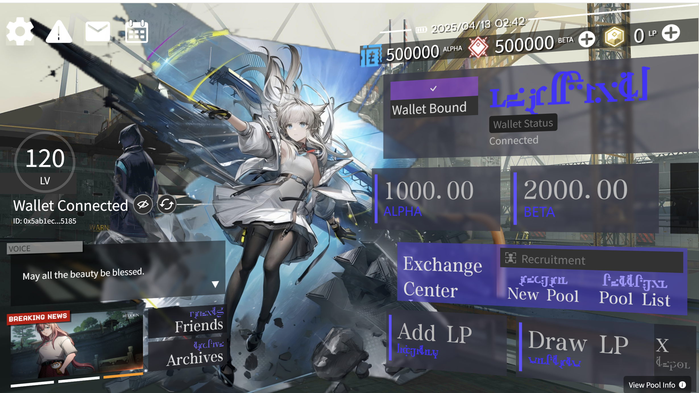
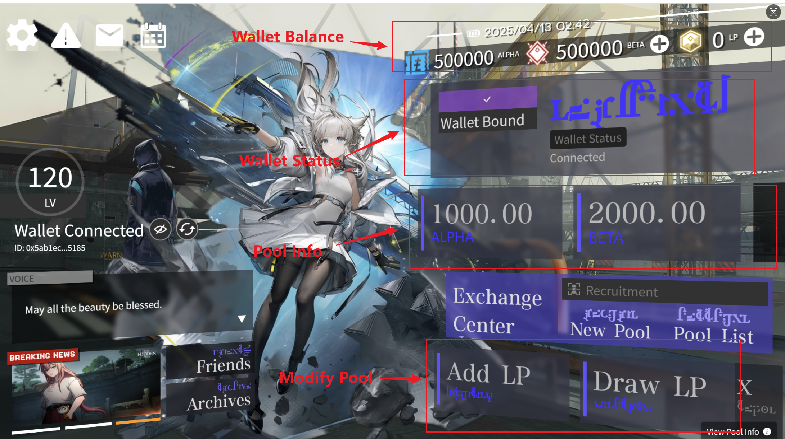
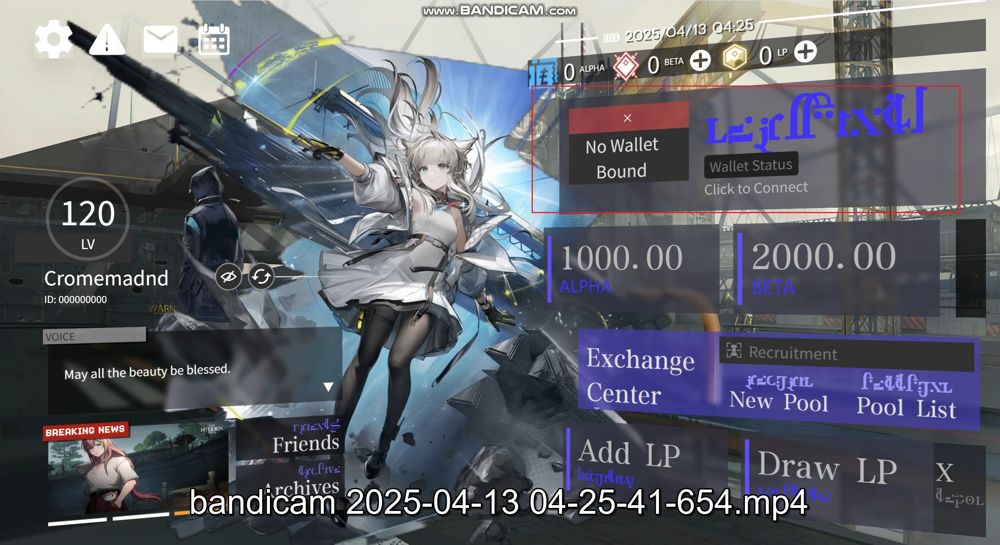
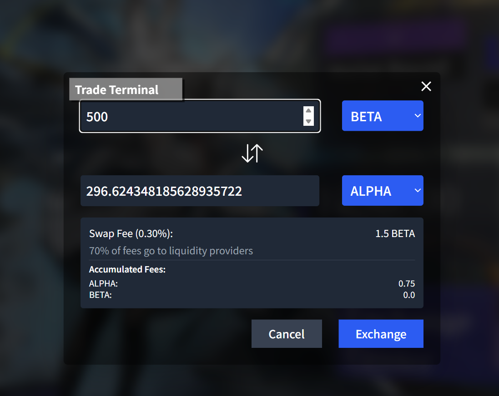
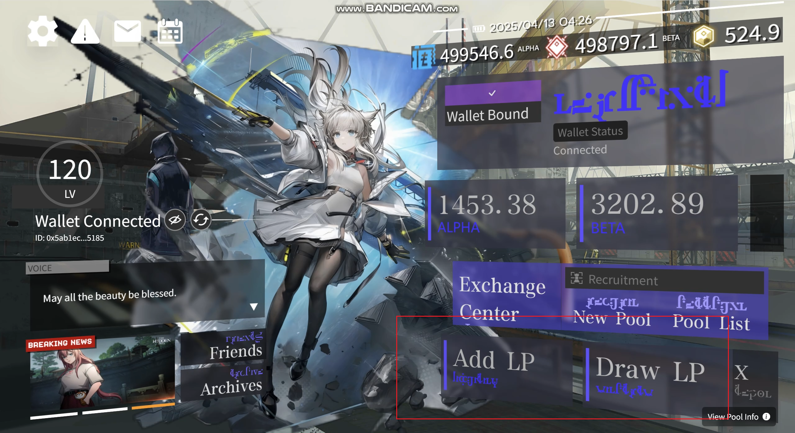
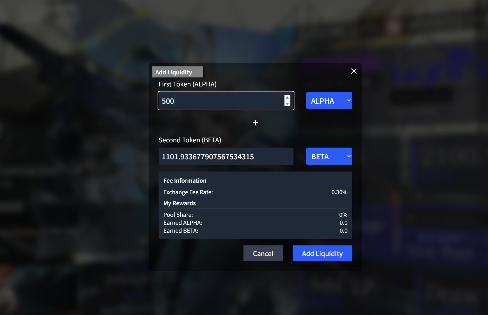

# DeFi-Guralu Swap

A decentralized token swap platform that allows users to exchange ERC-20 tokens directly from their wallet.

## Application Preview



## Introduction



## Quick Start

1. Clone this repository
2. Run `deploy.bat`
3. Enter your wallet address when prompted
4. Access the application at http://localhost:3000

## Prerequisites

- Windows 10/11
- [Docker Desktop](https://www.docker.com/products/docker-desktop/) installed and running
- [Git](https://git-scm.com/downloads) installed
- Internet connection

## Installation

```bash
# Clone the repository
git clone https://github.com/Guraaw/MyDocker.git

# Navigate to project directory
cd MyDocker

# Run deployment script
deploy.bat
```

## User Guide

### 1. Connect Your Wallet

First, connect your wallet by clicking on the "Wallet Status" button:



### 2. Exchange Tokens

Access the Exchange Center to swap tokens:


The Trade Terminal allows you to specify token amounts and execute swaps:



### 3. Manage Liquidity

You can add or remove liquidity from pools:



Detailed liquidity management interface:



## Configuration

The deployment process will:

1. Prompt you for your Ethereum wallet address
2. Automatically update transfer scripts with your address
3. Build and configure Docker container
4. Install all dependencies
5. Deploy smart contracts to a local Hardhat network
6. Start the frontend application

## Project Structure

```
defi-guralu/
├── build/                  # Build scripts
├── workspace/              # Main project files
│   ├── contracts/          # Smart contracts
│   ├── frontend/           # React frontend
│   ├── scripts/            # Deployment scripts
│   └── test/               # Contract tests
├── deploy.bat              # Main deployment script
├── docker-compose.yml      # Docker configuration
├── Dockerfile              # Container definition
└── setup.sh                # Dependency installation
```

## Available Scripts

After deployment, you can use:

- `test/add-alpha.bat` - Transfer ALPHA tokens to your wallet
- `test/add-beta.bat` - Transfer BETA tokens to your wallet
- `test/add-gura.bat` - Transfer GURA tokens to your wallet
- `test/run-script.bat` - Transfer Liquidity to current pool
- `init.bat` - Run the above actions

## Accessing the Application

- **Frontend**: http://localhost:3000
- **Hardhat Node**: http://localhost:8545

## Dependencies

All dependencies are automatically installed by the deployment script:

- Node.js 22.x (installed in Docker)
- Hardhat
- React
- Ethers.js
- Web3.js
- Tailwind CSS
- Vite

## Troubleshooting

If you encounter any issues:

1. Ensure Docker is running
2. Try stopping the container with `docker-compose down`
3. Re-run `deploy.bat`
4. Check logs with `docker logs defi-guralu`

## License

MIT 